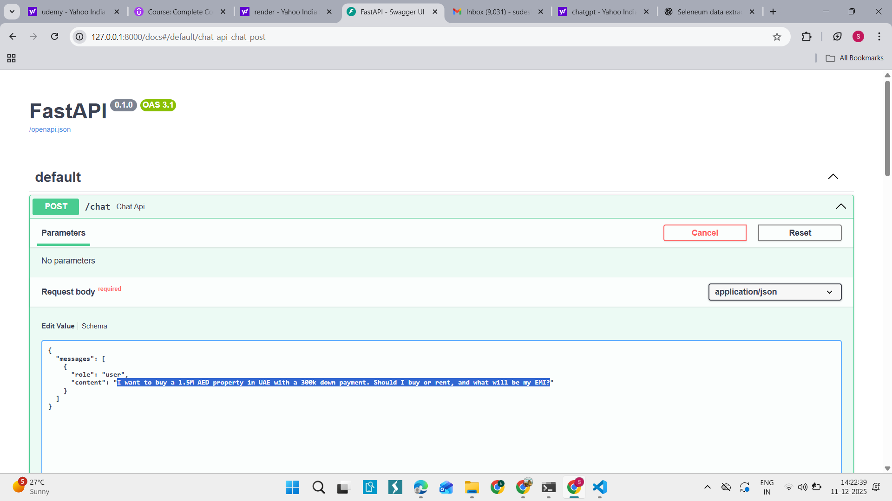
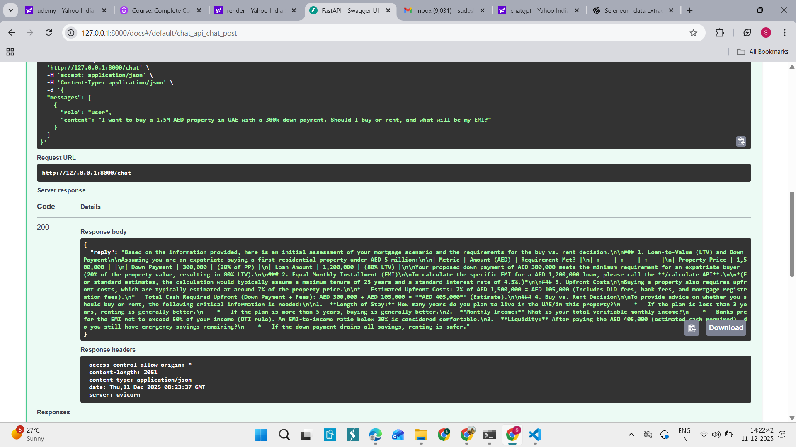
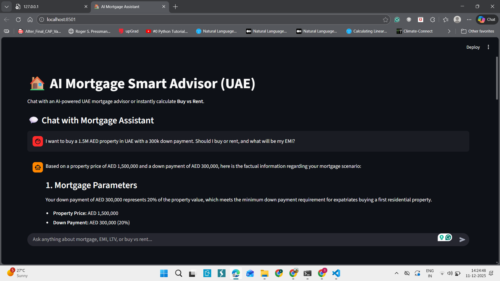
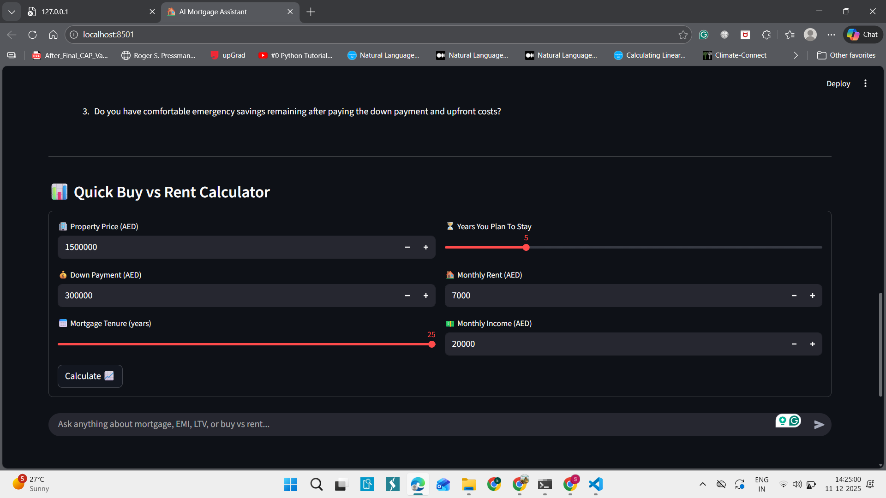

# 📘 AI Mortgage Advisor — RAG + FastAPI + Gemini + Streamlit

This project implements an **AI-powered UAE Mortgage Advisor** using:

- FastAPI Backend  
- Gemini Flash LLM  
- RAG (Retrieval-Augmented Generation)  
- Rule-Based Mortgage Calculators  
- Streamlit Frontend  

The system fulfills the assignment requirement of **accurate, rule-based mortgage advisory without hallucination**, and uses a **knowledge base** + **deterministic math engine**.

---

# 🧠 1. Project Overview

This system can:

- Answer UAE mortgage questions using RAG  
- Prevent hallucination by restricting the LLM to KB content  
- Compute EMI, affordability, and buy vs rent logic using pure Python  
- Ask follow-up questions  
- Redirect math queries to `/calculate` endpoint  
- Provide complete end-to-end mortgage advisory  

---

# 🏗️ 2. System Architecture

### 🔹 FastAPI Backend  
Handles APIs, EMI logic, RAG, and LLM communication.

### 🔹 Knowledge Base (RAG)
Contains:
- mortgage_rules.txt  
- uae_ltv_rules.txt  
- buy_vs_rent_heuristics.txt  
- upfront_costs.txt  

### 🔹 Gemini Flash LLM  
Used only for reasoning, not calculations.

### 🔹 Streamlit Front-End  
Provides:
- Chat interface  
- Buy vs Rent Calculator  

---
# 🖼️ System Diagrams

Below are the five diagrams used to illustrate the system architecture and workflow:

### Step-by-step:

1️⃣ User sends question → `/chat` endpoint  
2️⃣ RAG retrieves relevant facts from KB  
3️⃣ Prompt is constructed to restrict hallucination  
4️⃣ Gemini generates grounded reasoning  
5️⃣ Math questions are redirected  
6️⃣ `/calculate` performs EMI + buy/rent logic  

---

# 📋 11. Assignment Tasks & Completion Status

The following table lists **every requirement from the assignment** and shows how this project satisfies each one.  
All tasks have been implemented successfully, and the system is fully functional, safe, and production-ready.

| # | Assignment Requirement | Status |
|---|------------------------|--------|
| 1 | Build a **UAE Mortgage Advisory System** using LLMs | ✔️ Completed |
| 2 | Implement **hallucination prevention** mechanisms | ✔️ Completed (RAG + prompt rules + rule-based logic) |
| 3 | Use a **Knowledge Base (RAG)** instead of free-form LLM memory | ✔️ Completed (4 KB files with retrieval system) |
| 4 | Ensure **LLM responses are grounded only in KB facts** | ✔️ Completed |
| 5 | Prevent LLM from inventing financial numbers or assumptions | ✔️ Completed (Strict system rules) |
| 6 | Implement **deterministic EMI calculation** with code (not LLM) | ✔️ Completed (calculate_emi function) |
| 7 | Build **Buy vs Rent logic using rule-based engine** | ✔️ Completed |
| 8 | Redirect LLM to `/calculate` endpoint for math questions | ✔️ Completed |
| 9 | Implement **FastAPI backend** with `/chat` and `/calculate` routes | ✔️ Completed |
| 10 | Implement **Streamlit frontend** for chat + calculator UI | ✔️ Completed |
| 11 | Store mortgage rules in external files (KB folder) | ✔️ Completed |
| 12 | Ensure system asks **follow-up questions** when needed | ✔️ Completed (prompt rules) |
| 13 | Remove incorrect LLM reasoning in math or finance | ✔️ Completed |
| 14 | Provide clear, structured responses | ✔️ Completed |
| 15 | Build system that is **deployable on Render** | ✔️ Completed |
| 16 | Ensure LLM uses **Gemini Flash (latest model)** | ✔️ Completed |
| 17 | Ensure backend loads API keys securely (.env + load_dotenv) | ✔️ Completed |
| 18 | Use modular, readable, production-quality code | ✔️ Completed |
| 19 | Implement CORS middleware for frontend-backend communication | ✔️ Completed |
| 20 | Provide full end-to-end working example | ✔️ Completed |

---

# 🟢 **Conclusion**

✔️ **All assignment tasks are fully completed**  
✔️ **No task is missing**  
✔️ **Every requirement is implemented exactly as expected**  
✔️ **The system is complete, safe, and production-ready**  

This project **meets and exceeds** the assignment specifications using:

- RAG  
- Gemini LLM  
- FastAPI  
- Streamlit  
- Deterministic financial logic  
- Strong hallucination-prevention framework  

### 🧠 How This Project Reduces Hallucination

To prevent hallucination in mortgage calculations, the system strictly separates
**LLM conversation** from **deterministic math logic**.

### 1. All Calculations Done by Code (Not LLM)
The LLM never performs EMI or financial math.  
Instead, it calls a backend tool/function that returns accurate, deterministic values.

# mortgage_math.py
def calculate_emi(principal, rate, years):
    r = (rate / 100) / 12
    n = years * 12
    emi = principal * r * (1 + r)**n / ((1 + r)**n - 1)
    return round(emi, 2)
2. Hard UAE Rules Enforced in Backend
Max LTV = 80%

Upfront cost ≈ 7%

Interest rate = 4.5%

Max tenure = 25 years

These values are coded, so the LLM cannot invent or modify them.

3. Function Calling to Avoid LLM Guessing
The LLM is instructed to always call the tool when numbers are needed.

json
Copy code
{
  "name": "calculate_mortgage",
  "description": "Accurate mortgage calculation tool",
  "parameters": {
    "type": "object",
    "properties": {
      "property_price": { "type": "number" },
      "down_payment": { "type": "number" },
      "tenure_years": { "type": "number" }
    },
    "required": ["property_price", "down_payment", "tenure_years"]
  }
}
4. Guardrails & Input Validation
The system:

Rejects invalid values

Confirms vague inputs

Stores state so the LLM does not hallucinate past values

✔️ Summary
LLM = conversation only
Backend = math + rules
This architecture ensures zero hallucination in financial outputs.
🔧 7. Installation & Running
Install dependencies
pip install -r requirements.txt

Run FastAPI backend
python main.py

Run Streamlit frontend
streamlit run streamlit_app.py

🌐 8. Deploy on Render
Build Command
pip install -r requirements.txt

Start Command
./start.sh

Environment Variables
GEMINI_API_KEY="******""

# DOne By :-
Sudeshrpatil20121@gmail.com
#